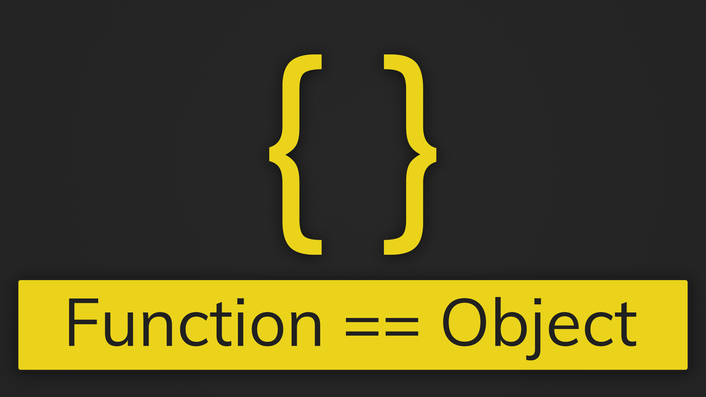

<link href="style.css" rel="stylesheet"></link>

# JavaScript Functions and the Call Stack

<h2 class="heading">Prerequisites</h2>

1. Arrays, Objects, Variables, Control Flow, Data Types, Command Line
2. Installation requirements:
	- Atom
		- Package: "`platformio-ide-terminal`"
	- Node

<h2 class="heading">Objectives</h2>

### 
Functions

